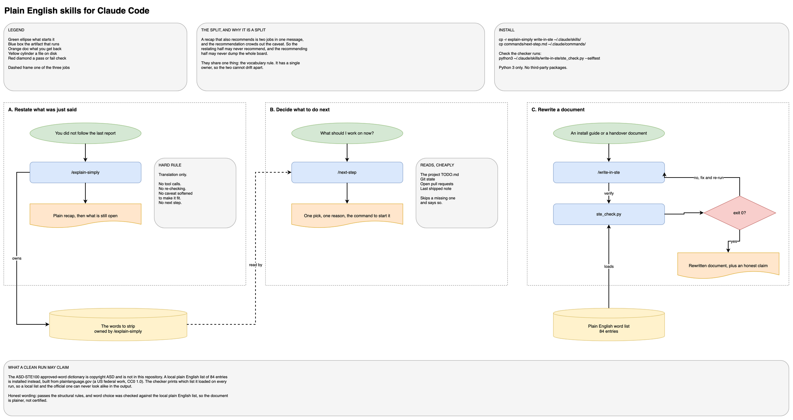

# Plain English skills for Claude Code

Three artifacts that make Claude write for a reader instead of for the session
it has been sitting in. They split one job three ways.

- **`/explain-simply`** re-says the last report in plain English for someone who
  was not reading along. It only translates: no new work, no re-checking, and it
  never softens a caveat to make it fit. It deliberately does not tell you what
  to do next.
- **`/next-step`** is the other half. It names what to do next in a few lines and
  gives you the command to start it.
- **`/write-in-ste`** rewrites a document you name into Simplified Technical
  English and runs a checker on it. For install guides and handover documents,
  not for chat.



## Why the split

A recap that also recommends is two jobs in one message, and the recommendation
crowds out the caveat. So `/explain-simply` may never recommend, and `/next-step`
may never dump the board. The one thing they share is the vocabulary rule, and
`/explain-simply` owns it: `/next-step` points at that file rather than keeping a
second copy that would drift.

`/write-in-ste` is the document half. Chat and a work instruction need different
discipline, and the sentence counter that helps a procedure makes a chat reply
stilted.

## Install

### Skills

```bash
mkdir -p ~/.claude/skills
cp -r explain-simply write-in-ste ~/.claude/skills/
```

They are available immediately as `/explain-simply` and `/write-in-ste`, and
Claude also triggers them on their own descriptions.

### Command

```bash
mkdir -p ~/.claude/commands
cp commands/next-step.md ~/.claude/commands/
```

Available as `/next-step`.

### Check the STE checker runs

```bash
python3 ~/.claude/skills/write-in-ste/ste_check.py --selftest
python3 ~/.claude/skills/write-in-ste/test_ste_check.py
```

The first prints `SELFTEST OK`. The second prints `PASS 60   FAIL 0`. Python 3
only, no third-party packages.

## Using the checker on its own

The checker is a plain command-line tool and does not need Claude:

```bash
python3 ste_check.py YOUR_DOC.md --mode procedural
python3 ste_check.py YOUR_DOC.md --mode descriptive
```

Exit 0 is clean, 1 means findings, 2 is a usage error. Add `--strict` to fail on
advisory findings too, `--json` for machine output.

Findings come in two bands. **Hard** is mechanical and near certain: sentence
length, paragraph length, perfect tenses, passive voice in a procedure.
**Advisory** is a heuristic that can over-fire. Read an advisory finding before
you obey it. If it fires on correct text, that is a bug in the rule, and the fix
belongs in `ste_check.py` or `dictionary/ing_allow.txt`, not in your document.

The checker excludes fenced blocks, inline code spans, headings, tables, link
targets and YAML frontmatter, so it never rewrites a command or an identifier.

## The word list, and what a clean run may claim

Read `write-in-ste/dictionary/README.md` before you report anything as compliant.

The core of ASD-STE100 is its approved-word dictionary, about 900 words each
locked to one meaning, plus about 1200 not-approved words with substitutes. That
dictionary is copyright ASD and is **not** in this repository. A local
plain-English list is installed instead, 84 entries built from plainlanguage.gov
(a US federal work, CC0 1.0) and a list of words that mark machine-written prose.

The checker prints which list it loaded on every run. The honest claim is:

> Passes the structural rules. Word choice was checked against the local plain
> English list, not the ASD-STE100 approved dictionary, so this document is
> plainer, not certified.

If you obtain the official specification from https://www.asd-ste100.org/, read
its own copyright terms before putting any part of the dictionary in a
repository. `dictionary/README.md` covers how to swap it in, and why a partial
copy is worse than none.

## What `/next-step` reads

It ranks work from whatever it can see cheaply: a project `TODO.md`, the git
state of the linked repo, open pull requests, and the most recent shipped entry
in the project notes. Every source is optional; it skips a missing one and says
so rather than reporting a zero it did not measure.

It assumes a per-project `TODO.md` under `~/.claude/projects/<name>/`, which is
the convention the `todo` skill in
[multi-phase-skills-framework](https://github.com/eranw2000/multi-phase-skills-framework)
writes. That pairing is optional. Without it, `/next-step` ranks on git state and
pull requests alone.

It is read-only. It inspects and reports, and offers to start the work only after
you say yes.

## Model routing

The two skills are pinned `model: opus`, because rewriting prose for a reader is
quality-sensitive work. `/next-step` uses `model: inherit`, so it runs on whatever
model your session is on.

To change or remove a pin, edit the `model:` line in the artifact's frontmatter.
Deleting the line entirely makes the artifact run on the session model.

## License

MIT. See `LICENSE`.

The word list carries its own provenance in
`write-in-ste/dictionary/not_approved.txt` and `dictionary/README.md`. Nothing in
this repository reproduces ASD-STE100.
